# MCP Workshop

This is the practical part of the MCP workshop. You will learn both how to connect your vscode environment to community MCP servers and how to build your own.

At the end of this workshop, you will:
- Gain a basic knowledge mcp
- Know how to setup an MCP server to use with Github Copilot
- Know where to get started to build your own MCP Server

## Prerequisites:
If you are using the dev container, everything should be setup for you.
If not, you will need the following:
- node & npm
- python & uv
- python's fastmcp sdk

## How to use in gitpod
After you opened it using the link in the top-level readme, you'll need to open a workspace in for this directory. From the root directory, you can do that by running `cd workshops/MCP_workshop` in a terminal.

## How to use the dev container
To use the dev container, you will need to install the dev container extension below:\
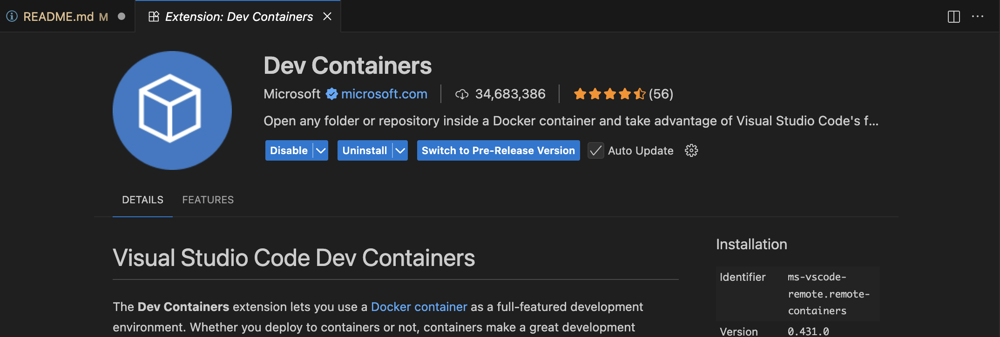

Then, when you launch vscode in this repository, you should get the popup as below:\
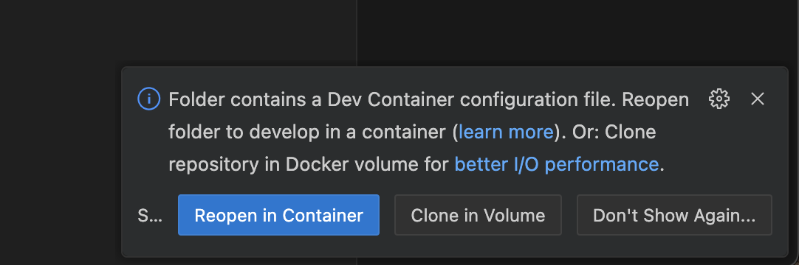

Don't get the pop? Force reopen in dev container as below:\
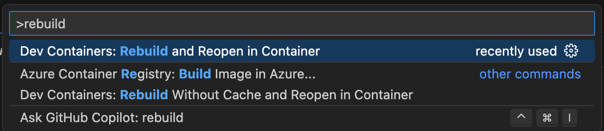

## Using MCP Servers

### Connect to npx filesystem MCP Server

If you're using the dev container, the filesystem MCP server is already pre-built for you. All you need to do is to enable the use of the MCP server and its corresponding tools.
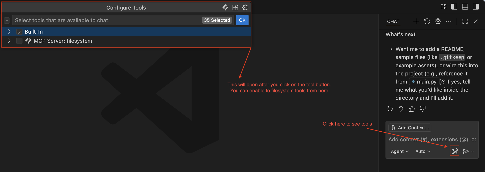
If you're not using the dev container, add a `.vscode/mcp.json` with the following content:
```json
{
  "servers": {
    "filesystem": {
      "type": "stdio",
      "command": "npx",
      "args": [
        "-y",
        "@modelcontextprotocol/server-filesystem",
        "path to Folder" // Replace the line with your project 
      ]
    }
  }
}
```
You will then have a **start** option appear just above your mcp server name (here, `filesystem`)

### Connect to AWS MCP

There are quite a few AWS MCP Servers: for Infrastructure & Development, for AI & Machine Learning,... Most of them will require you to configure an appropriately-scoped IAM User, which you can learn more about [here](https://docs.aws.amazon.com/cli/v1/userguide/cli-configure-files.html). For the sake of time, we will leave those out in this workshop and focus on an AWS MCP Server which allows you to access real-time documentation. You can find out more about that knowledge mcp server [here](https://github.com/awslabs/mcp/tree/main/src/aws-knowledge-mcp-server). In a nutshell, you can install it by adding the following to the `.vscode/mcp.json` file and starting it as you've done above.:
```json
"aws-knowledge-mcp-server": {
  "command": "uvx",
  "args": ["fastmcp", "run", "https://knowledge-mcp.global.api.aws"]
}
```
**Why is this MCP Server interesting?** The LLMs that we use have a training cutoff date. Past that date, they are not aware of any new information. For example, Claude Sonnet 4.5 has a [training data cutoff in July 2025](https://docs.claude.com/en/docs/about-claude/models/overview).\
However, when you're dealing with IT systems, being are fast-evolving, the information you get by querying those might have become obsolete, or worse, erroneous. 
In this exercise, you can try to find a [latest AWS news](https://aws.amazon.com/new/), and ask your LLM about it. For example, when I ask the plain LLM (without tools) if Amazon CloudWatch Logs supports Network Load Balancer access logs, [a news from November 2025](https://aws.amazon.com/about-aws/whats-new/2025/11/amazon-cloudwatch-supports-logs-network-load-balancer-access-logs/):\
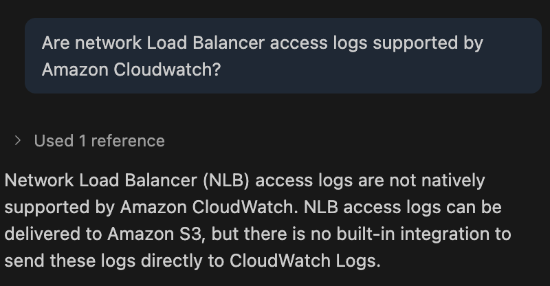

After I've enabled the tools to be used however, the LLM is able to answer the same question correctly:\
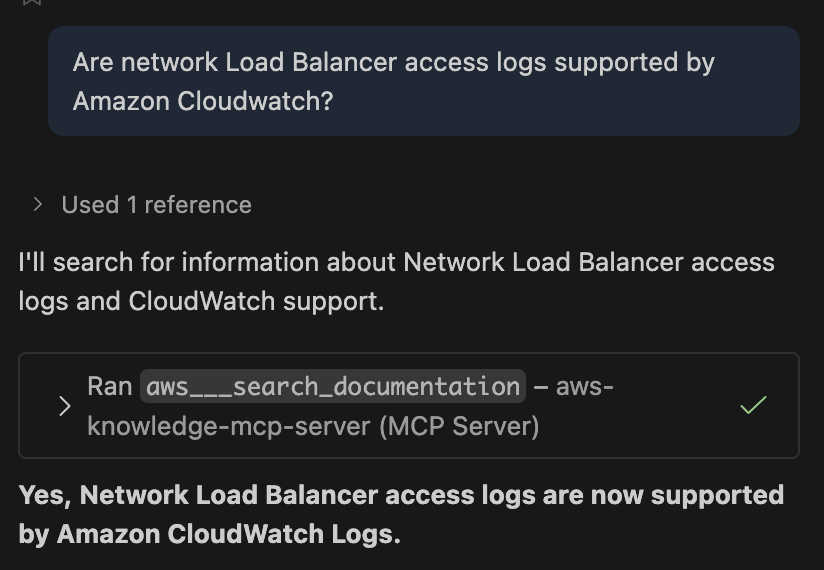

### Connect to Atlassian Rovo MCP Server

You can find the Atlassian MCP Server in the vscode extension marketplace, or other ways to install the Atlassian MCP [in the docs](https://support.atlassian.com/atlassian-rovo-mcp-server/docs/setting-up-ides/).

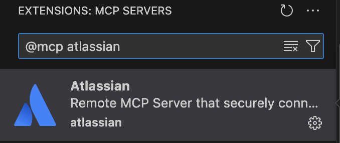

From there, after following the authentication flow, you should have the new Atlassian server and its tools available.

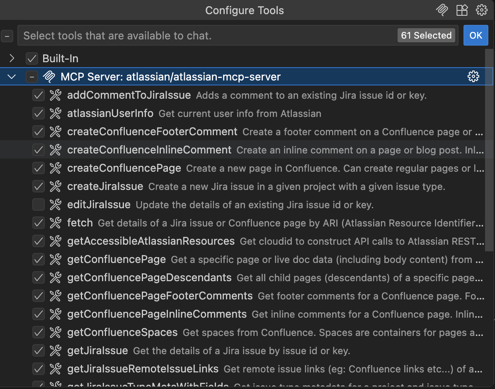

From this point onwards, try any of the following:
- Summarize the content of a confluence page
- Create a Jira ticket
- Create an inline comment on a confluence page

### Hackaway!

There are many places where you can find MCP servers to connect to, here are a few examples:
- MCP can be installed as a VSCode extension, simply look for the **@mcp** filter
- 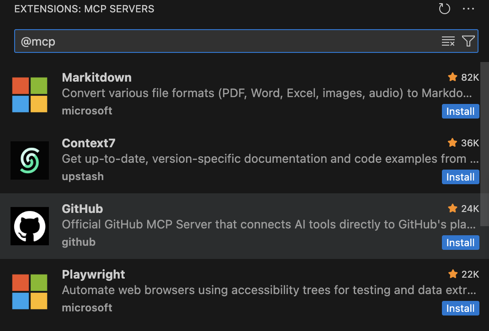
- [Github](https://github.com/modelcontextprotocol/servers) is a great source to find a bunch of community MCP servers
- [Smithery ai](https://smithery.ai) also has quite a few of them:
- Docker has now has a tab to quickly install MCP servers on some servers. Currently supports Claude Desktop, Cursor and Gemini CLI (don't see it? Update your docker desktop version)


## Building MCP Servers

### Create a tool

The `main.py` is a boilerplate to kick start you in building your own MCP server. Add your tool there

### Run MCP Inspector locally

MCP Inspector gives you a nice, interactive view where you can easily test your MCP server.
You can run it with `uv run mcp dev main.py` then open the link (if it does not open automatically).

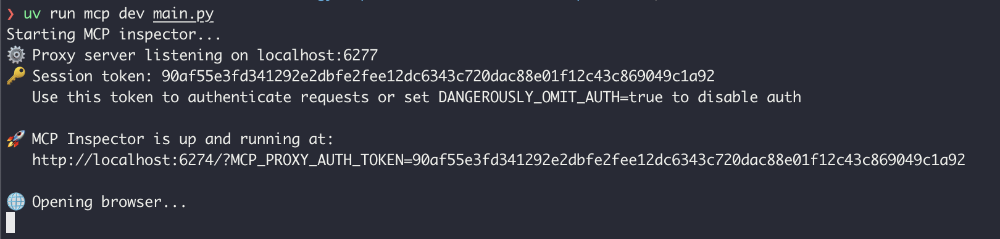
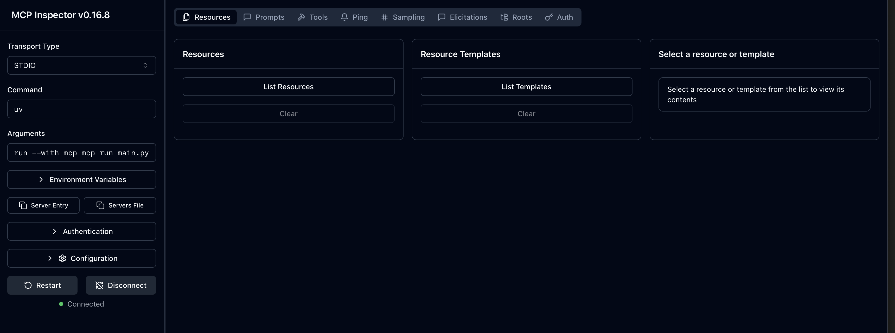

### Connect your MCP Server to your local IDE

Create a folder `.vscode` and a file `.vscode/mcp.json`
Insert the following:
```json
{
    "servers": {
        "demo_mcp": {
        "type": "stdio",
        "command": "uv",
        "args": [
            "--directory",
            "/workspaces/MCP_Workshop", // Adapt this part if you're not using the dev container
            "run",
            "main.py"
            ]
        }
    }
}
```

### Hackaway!

You now have all the _tools_ (😉) to build your own MCP server. 
Try to create more tools, resources and prompts. Inspect and debug them using the MCP Inspector utility.
Remember that you will always need to restart the connection between the client and the server for a new protocol exchange to discover new tools/resources/prompts.