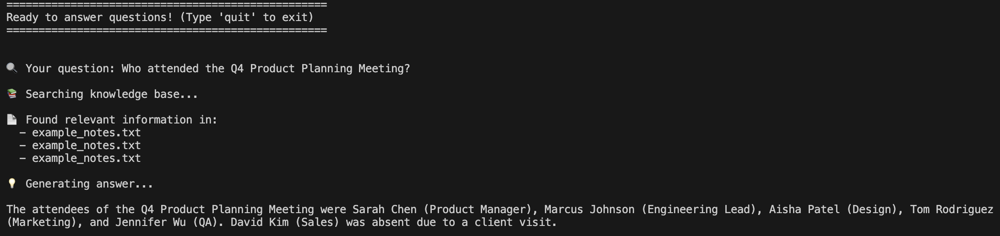
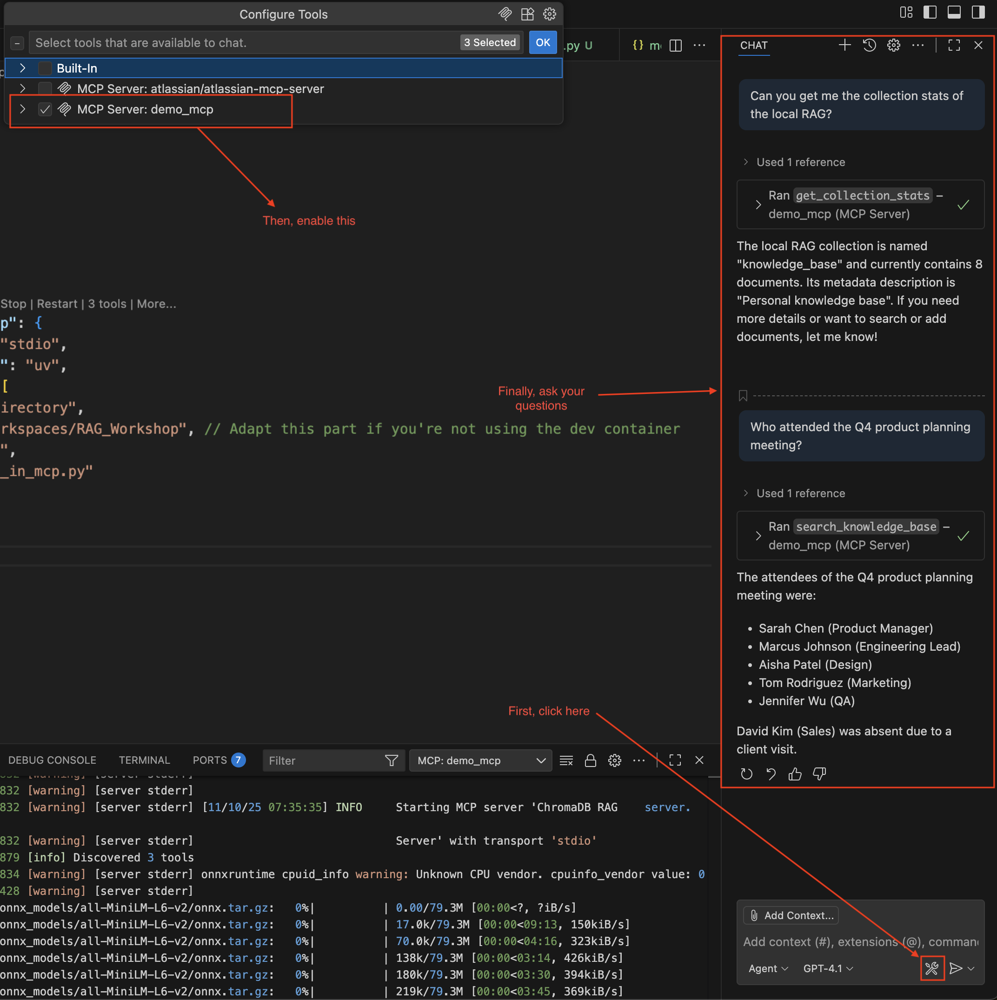

# MCP Workshop

This is the practical part of the RAG workshop. You will gain a visual understanding of word embedding and something else (still TBD at this point).

## Prerequisites:
If you are using the dev container, everything should be setup for you.
If not, you will need the following:
- python & uv
- all of the following python dependencies (which can be install by running `uv sync`):
    - chromadb
    - gensim
    - ipykernel
    - jupyter
    - matplotlib
    - nltk
    - numpy
    - openai
    - scikit-learn
    - sentence-transformers
    - torch
    - transformers
    - fastmcp

## Word Embedding
In this exercice, we explore word embeddings and visualize multiple word embeddings in 2D.
When you launch the dev container, it will open a jupyter instance, you only to open the link provided.

If you do not use the dev container, you will have to start jupyter on your own, you can do so by running `uv run jupyter notebook --ip=0.0.0.0 --port=8888 --no-browser --allow-root`.

The `word_embedding.ipynb` contains a comprehensive boilerplate to get you started learning about playing with embeddings 

### Word2Vec
Explore how Word2Vec captures information about the meaning of the word based on the surrounding words. Visualize how similar words cluster together in 2D space
You can also experiment with analogies like "king - man + woman = queen".

### Doc2Vec
Doc2Vec, an extension of Word2Vec, generates embeddings for entire documents or sentences.
Document vectors can capture semantic meaning and enable tasks like document similarity and classification.

### Create your own
Try building a custom word embedding model. Adjust parameters and preprocessing steps to observe how embeddings change, and visualize the results to gain intuition about the process.

### [Bonus] Task-aware embedder -> Qwen3
Experiment with advanced, task-aware embedding models such as Qwen3. Learn how these models generate context-sensitive embeddings tailored for specific tasks, improving performance in applications like question answering or sentiment analysis

## Using a RAG with Github Copilot

In this exercice, you can use a simple RAG implementation with Github Copilot.\
In the `main.py`, you can find the implementation using chromaDB

### Setting up an API Key
Create a GitHub Personal Access Token:

- Go to https://github.com/settings/tokens
- Click "Generate new token (classic)"
- Give it a name like "RAG Workshop"
- Select the copilot scope
- Generate and copy the token

Set the environment variable:\
`export GITHUB_TOKEN='API_KEY'`

### Read through the code
Familiarize yourself with the code, the main attention points would be:
- How do we create the collection?
- How do we add documents to that collection?
- How do search for relevant chunks in that collection?

### Fill in the todos
There are three todos for you to fill in. They are in line 224, 227 and 246.

### Use it in your terminal
You can then use it in your terminal by running `uv run main.py`
Documents in the my_documents folder will be indexed. It has been pre-populated with a AI-generated meeting notes. Below is an example of how you can use it. You can also add your own documents and play around with it.

### [Bonus] Hook it in mcp and use from copilot chat
# TODO make the code there better, currently not great
The `rag_in_mcp.py` defines a local MCP that runs the chromadb RAG.
The `.vscode/mcp.json` file also enables this MCP to be used in your local Github Copilot chat.
Below is an example of how to use this:

### Hackaway!
Use the RAG system with your meeting notes, ask an LLM to summarize, analyse sentiments, extract information, connect the dots...